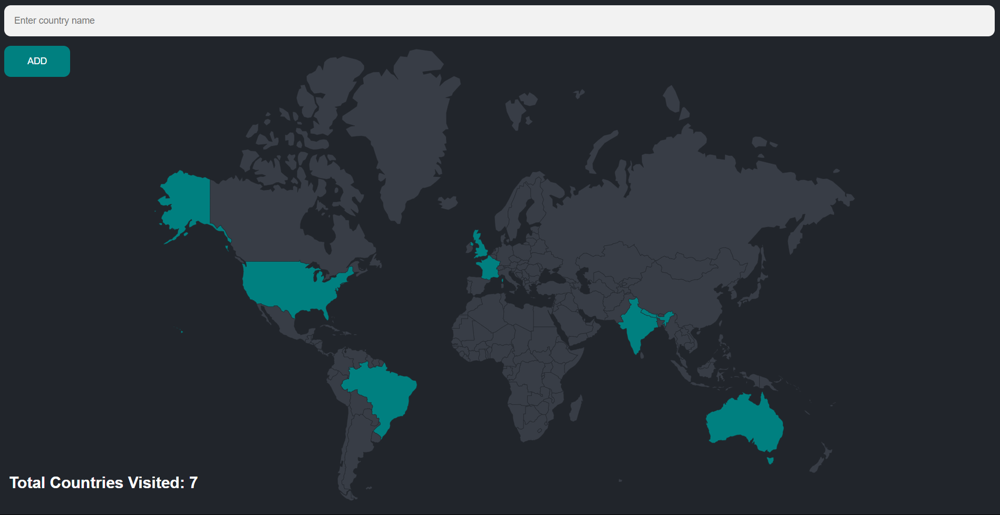

# Travel-Tracker
<h2>Installation:</h2>
<ul>
  <li>Travel Tracker webpage is made using express and PostgreSQL.</li>
  <li>Run command <b>npm i</b> to install the node modules.</li>
  <li>Run <b>npm i pg</b> to install postgres.</li>
  <li>Run <b>nodemon index.js</b> .</li>
  <li>Create a database in pgadmin.</li>
  <li>Create tables 'visited_countries' to store the list of all visited countries.</li>
  <li>Use the table 'countries' to check for the country codes.</li>
  <li>Open the page in http://localhost:3000/ to try it out!</li>
</ul>
<h3>Output:</h3>

